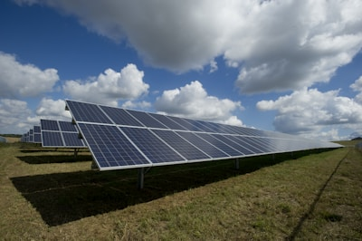

# 🌞 ALFTech Solar - Landing Page

Landing Page institucional e de alta conversão para empresa de energia solar, desenvolvida com HTML5, Tailwind CSS e JavaScript Vanilla.

## ✨ Características

- ✅ Design moderno e profissional
- ✅ Totalmente responsivo (Mobile-First)
- ✅ Animações suaves e interativas
- ✅ Simulador de economia interativo
- ✅ FAQ com accordion animado
- ✅ Efeitos de hover nas imagens
- ✅ Menu mobile funcional
- ✅ Botão flutuante do WhatsApp
- ✅ Otimizado para conversão
- ✅ Performance otimizada

## 🎨 Paleta de Cores

- **Verde**: #10b981 (Sustentabilidade)
- **Azul**: #3b82f6 (Confiança)
- **Amarelo/Laranja**: #f59e0b (Energia Solar)
- **Cinza**: #f8f8f8 (Fundos)

## 📂 Estrutura do Projeto

```
alftech-solar/
│
├── index.html              # Página principal
├── README.md              # Este arquivo
│
├── assets/
│   ├── css/
│   │   └── style.css      # Estilos customizados
│   │
│   ├── js/
│   │   └── script.js      # JavaScript e interatividade
│   │
│   └── images/            # Pasta para imagens
│       └── logo.png       # Logo da empresa
```

## 🚀 Como Usar

### 1. Visualizar Localmente

Simplesmente abra o arquivo `index.html` em qualquer navegador moderno:
- Chrome
- Firefox
- Safari
- Edge

### 2. Servidor Local (Recomendado)

**Opção 1 - Python:**
```bash
cd alftech-solar
python -m http.server 8000
```
Acesse: http://localhost:8000

**Opção 2 - Node.js:**
```bash
cd alftech-solar
npx http-server -p 8000
```
Acesse: http://localhost:8000

**Opção 3 - VS Code:**
Instale a extensão "Live Server" e clique com botão direito no `index.html` > "Open with Live Server"

## 🎯 Seções da Página

### 1. Header/Menu
- Logo da ALFTech Solar
- Links de navegação
- Telefone de contato
- Botão CTA para WhatsApp
- Menu mobile responsivo

### 2. Hero Section
- Título impactante
- Benefícios principais
- CTAs de ação
- Card de economia animado

### 3. Simulador de Economia
- Slider interativo
- Cálculo em tempo real
- Visualização de economia mensal e total
- CTA para orçamento

### 4. Estatísticas
- +90.000 Projetos Instalados
- +400 Colaboradores
- 25 Anos de Garantia
- 95% de Economia Média

### 5. Sobre a Empresa
- História e missão
- Certificações
- Equipe especializada

### 6. Serviços
- Residencial
- Empresarial
- Rural

### 7. Projetos Realizados
- Grid de 6 projetos
- Efeitos de hover com zoom
- Informações detalhadas

### 8. Depoimentos
- 3 depoimentos de clientes
- Avaliações 5 estrelas
- Botões para vídeos

### 9. FAQ
- 6 perguntas frequentes
- Accordion animado
- Respostas detalhadas

### 10. Footer
- Informações da empresa
- Links úteis
- Redes sociais
- Contato

## 🎨 Personalização

### Alterar Cores

Edite as classes do Tailwind no arquivo `script.js` ou adicione novas cores no `style.css`.

### Alterar Conteúdo

Todo o conteúdo está no arquivo `assets/js/script.js` nas variáveis HTML. Edite diretamente lá.

### Adicionar Logo

Substitua o ícone no header por uma imagem:
```javascript
// No script.js, linha do logo:

```

### Informações de Contato

Procure por `5511999999999` no código e substitua pelo número real:
```javascript
// Formato: 55 + DDD + Número
const whatsappNumber = '5511999999999';
```

Atualize também:
- Telefone no header
- Email no footer
- Endereço no footer

## 🔧 Funcionalidades JavaScript

### Menu Mobile
- Toggle animado
- Fecha ao clicar em links
- Ícone muda de hamburger para X

### Simulador
- Atualização em tempo real
- Cálculo de economia
- Projeção de 25 anos

### FAQ Accordion
- Abre/fecha suavemente
- Fecha outros ao abrir um
- Ícone + vira -

### Scroll Effects
- Header muda ao rolar
- Elementos aparecem ao scroll
- Animações suaves

### Hover Effects
- Imagens com zoom
- Cards flutuam
- Botões com escala

## 📱 Responsividade

O site é totalmente responsivo e se adapta a:
- 📱 Smartphones (320px+)
- 📱 Tablets (768px+)
- 💻 Desktops (1024px+)
- 🖥️ Telas grandes (1440px+)

## 🌐 Deploy

### Opção 1 - GitHub Pages (Grátis)

1. Crie um repositório no GitHub
2. Faça upload dos arquivos
3. Vá em Settings > Pages
4. Selecione a branch main
5. Seu site estará em: `https://seuusuario.github.io/alftech-solar`

### Opção 2 - Netlify (Grátis)

1. Acesse [netlify.com](https://netlify.com)
2. Arraste a pasta `alftech-solar` para o site
3. Pronto! Seu site estará online

### Opção 3 - Vercel (Grátis)

1. Acesse [vercel.com](https://vercel.com)
2. Importe o projeto
3. Deploy automático

## 🎯 SEO e Performance

### Otimizações Incluídas:
- Meta tags otimizadas
- Estrutura HTML5 semântica
- Imagens otimizadas (via Unsplash)
- CSS e JS minificados (em produção)
- Lazy loading de imagens
- Scroll suave
- Animações performáticas

### Melhorias Sugeridas:
1. Adicionar Google Analytics
2. Implementar Schema Markup
3. Adicionar sitemap.xml
4. Configurar robots.txt
5. Otimizar imagens locais
6. Adicionar PWA (Progressive Web App)

## 🔄 Atualizações Futuras

- [ ] Sistema de blog
- [ ] Integração com CRM
- [ ] Chat online
- [ ] Calculadora avançada
- [ ] Portal do cliente
- [ ] Galeria de fotos expandida
- [ ] Vídeos de depoimentos
- [ ] Mapa de unidades

## 📞 Suporte

Para dúvidas ou suporte sobre o código:
- Consulte a documentação do Tailwind CSS: https://tailwindcss.com
- Documentação do Font Awesome: https://fontawesome.com

## 📄 Licença

Este projeto foi desenvolvido para uso comercial da ALFTech Solar.

## 🙏 Créditos

- **Design**: Inspirado em ecopower.com.br
- **Imagens**: Unsplash (https://unsplash.com)
- **Ícones**: Font Awesome (https://fontawesome.com)
- **Framework CSS**: Tailwind CSS (https://tailwindcss.com)
- **Fontes**: Google Fonts - Inter (https://fonts.google.com)

---

**Desenvolvido com ❤️ para ALFTech Solar**

*Última atualização: Junho 2024*